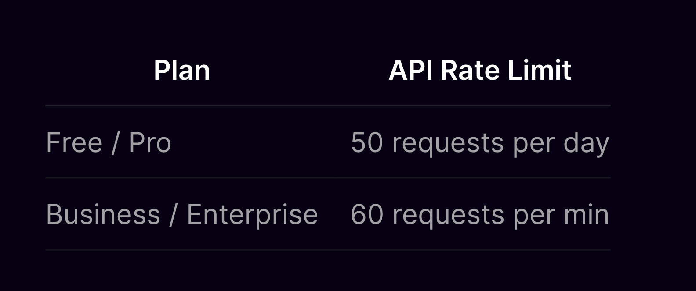

# FireFlies.ai Bulk Audio Uploader

This Node.js script allows you to bulk upload audio files to FireFlies.ai for transcription.

The script reads a list of audio files with their titles and URLs, and uploads each file to FireFlies.ai with a specified delay between uploads to avoid rate limiting.

## Prerequisites

- Node.js installed on your machine.
- A FireFlies.ai account with an API key.
- A `.env` file with your FireFlies.ai API key.

## Installation

1. Clone the repository:

   ```bash or zsh
   git clone https://github.com/yourusername/fireflies-bulk-audio-uploader.git
   cd fireflies-bulk-audio-uploader
   ```

2. Install the dependencies:

   ```bash or zsh
   npm install
   ```

3. Create a `.env` file in the root of the project with your FireFlies.ai API key:

   ```
   FIREFLIES_API_KEY=your_api_key_here
   ```
See the [FireFlies.ai Docs](https://docs.fireflies.ai/getting-started/quickstart) for more information on how to obtain an API key.

## Usage

1. Modify the `allAudio` array in the script with your audio files' titles and URLs.

2. Run the script:

   ```bash
   node uploadAudio.js
   ```

## Configuration

- **Delay Between Uploads**: The script includes a delay between uploads to avoid rate limiting. You can adjust the delay by modifying the `uploadAudioWithDelay` function call:

   ```javascript
   uploadAudioWithDelay(1250); // 1.25 seconds delay
   ```

The delay in the script is for FireFlies.ai premium users rate limit.



## Example

Here is an example of the `allAudio` array format:

```javascript
const allAudio = [
  { title: "Example Title 1", url: "https://example.com/audio1.mp3" },
  { title: "Example Title 2", url: "https://example.com/audio2.mp3" },
  // Add more audio files as needed
];
```

## Notes

- The script uses the FireFlies.ai GraphQL API to upload audio files.
- Ensure that the audio URLs are correctly formatted and accessible.
- Handle any potential errors during the upload process by checking the console logs.

---

Feel free to adjust the content as needed for your specific use case.

–––

For feature requests, questions, or feedback, please reach out to me via email at jer.boulerice@gmail.com

––

If you'd like to have videos converted to audio, files hosted and/or the process handled, feel free to reach out to me at the email above.

```